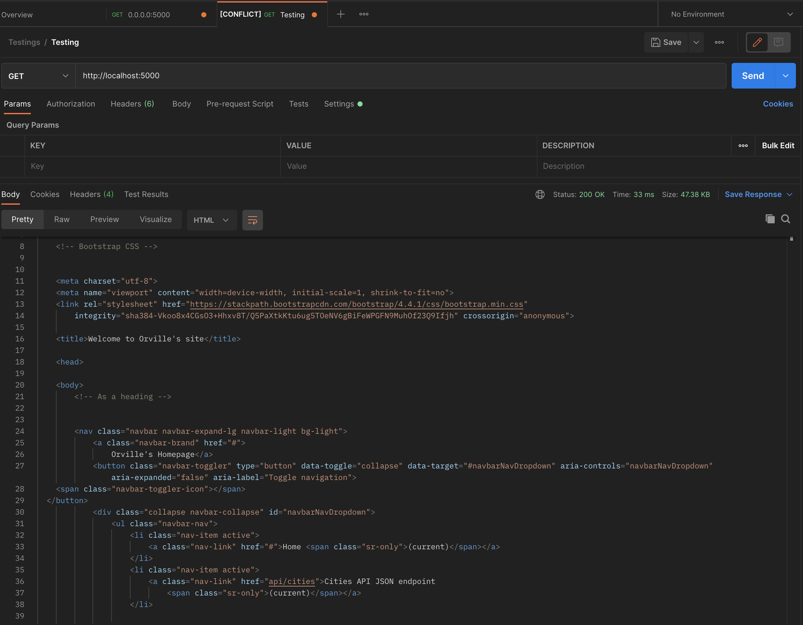
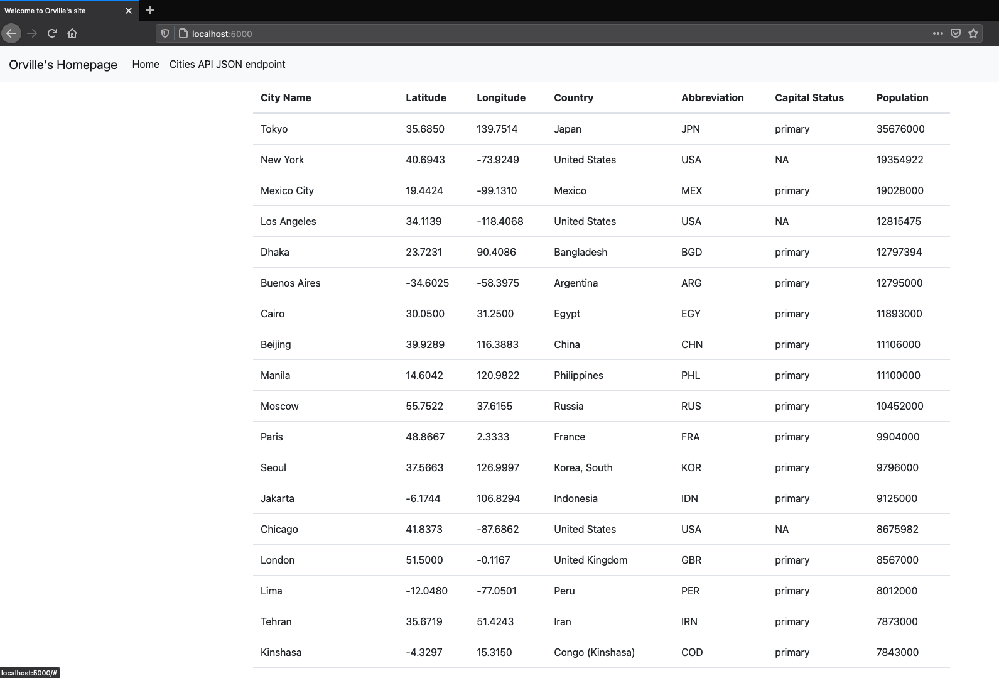

# *__Assignment Description__*:
In this assignment, I've learned to incorporate templates with Flask via PyCharm,
using Docker, and saving the repository to GitHub for the record and viewing of others.

# *__Screenshots__*:
# Postman Screenshot:

# MySQL Screenshot:
